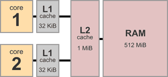
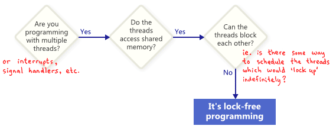

### 编译时指令重排
参见[文章](https://preshing.com/20120625/memory-ordering-at-compile-time/)

#### 抓住那个重排犯
参见[文章](https://preshing.com/20120515/memory-reordering-caught-in-the-act/)
- `asm volatile("" ::: "memory");`仅仅`只限制编译器重排`，对cpu重排不做限制
- `asm volatile("mfence" ::: "memory");`限制内存重排，是一个` a full memory barrier`
- `pthread_setaffinity_np`还可以通过限制多线程只在一个cpu上执行实现

特别的，`mfence`指令是`x86/64`独有的。linux内核使用`smp_mb`包裹之, 且有变种`smp_rmb`and`smp_wmb`

### 内存屏障
参见[文章](https://preshing.com/20120710/memory-barriers-are-like-source-control-operations/)

场景模拟：多核架构如下



将多cpu线程间的协作类比为多人协作编程


两者工作若互相独立时内存可以无需屏障，其重要点凸显在需要访问共享变量时，需要通过内存屏障保证协同性（例如一般会使用多个变量，一个作为flag）

#### 内存屏障类型
抽象上可分为四种类型，不同cpu指令是这些类型组合。


1. `#LoadLoad`保证屏障前后读操作不重排。e.g.使得flag成功判定后再去读真实数据。(注意这俩都是共享变量，需要原子操作)
2. `#StoreStore`保证屏障前后写操作不重排。e.g.与上类似，保证正确更新数据后再去更新flag通知变量，保证数据的一致性
3. `#LoadStore`保证屏障前读操作不重排到屏障后写操作之后。e.g.cache missing时可能发生先写后读的指令重排，使用该屏障可以限制相关操作。注意理论上前两者组合并不能得到该屏障，虽然实际实现上该屏障大多内含前两者之一。
4.`#StoreLoad`保证屏障前的写操作不重排到读操作之后。e.g.特别是在`r1=r2=0`的场景下，只有该屏障能保证正确结果。但注意似乎该屏障开销较大，略似完全一致性顺序。

另有[论文](http://www.rdrop.com/users/paulmck/scalability/paper/whymb.2010.07.23a.pdf)一篇


### 移动获取语义
参见[文章](https://preshing.com/20120913/acquire-and-release-semantics/)

定义可参考以下一种说法

    Acquire semantics is a property that can only apply to operations that read from shared memory, whether they are read-modify-write operations or plain loads. The operation is then considered a read-acquire. Acquire semantics prevent memory reordering of the read-acquire with any read or write operation that follows it in program order.

    Release semantics is a property that can only apply to operations that write to shared memory, whether they are read-modify-write operations or plain stores. The operation is then considered a write-release. Release semantics prevent memory reordering of the write-release with any read or write operation that precedes it in program order.

总结下即

- 获取语义限制`读操作之后`的指令被重排到前面，保证fence之前的值已被获取，例如获取锁
- 释放语义限制`写操作之前`的指令重排到后面，保证fence之后所有指令被执行完毕，例如释放锁

特别可参见该图


例子如下，通过内存屏障`保证两线程获取数据的一致性`（例子中，当thread2读到r1==1时，r2一定也已经被赋值为42。Thread1生产者`两个连续写`间使用release保证其顺序一致，Thread2`两个连续读`间使用acquire保证不重排，实际Ready变量这里应该是个flag通知变量，Thread2应先对其做判断）


acq-rel锁保证了临界区的实现


### 无锁编程
参见[文章](https://preshing.com/20120612/an-introduction-to-lock-free-programming/)

简单定义lock-free programming:



涉及技术及选择方式如下


#### 原子性操作

1. 简单变量的aligned read and write一般是原子的
2. `RMW`则更进一步，适合于有多个写者时（此时会形成一个队列并顺序访问相同地址），C++中则有`std::atomic<int>::fetch_add`。注意C++中并不保证某指令在当前平台一定是无锁的，可以通过`std::atomic<>::is_lock_free`进行判断。注意即使是单线程，有多个写者时也需要使用原子性操作保证事务的完整性。
3. `CAS`一般用在循环中来反复进行，先将shared variable赋值给local variable，并对其做自己想要的更改，再验证与旧值相同时进行更新，不同时至少说明其他线程刚成功更新该值。
4. 顺序一致性。最简单的方式是关闭编译器优化并强制线程在单核上运行（因为单处理器自身不会让自己的结果不一致，即使发生了抢占调度）。C++11中原子变量类型能保证顺序一致性，一般靠内存屏障或RMW操作实现。
5. 内存排序，作者分为三种类别，即轻量级fence，全内存屏障和移动获取语义。(注：Acquire semantics prevent memory reordering of operations which follow it in program order, and release semantics prevent memory reordering of operations preceding it. 该方式非常适合生产者消费者模型，其中一个生产者发布信息，其他线程进行读取)

`CAS`实现的无锁队列如下
```
void LockFreeQueue::push(Node* newHead)
{
    for (;;)
    {
        // Copy a shared variable (m_Head) to a local.
        Node* oldHead = m_Head;

        // Do some speculative work, not yet visible to other threads.
        newHead->next = oldHead;

        // Next, attempt to publish our changes to the shared variable.
        // If the shared variable hasn't changed, the CAS succeeds and we return.
        // Otherwise, repeat.
        if (_InterlockedCompareExchange(&m_Head, newHead, oldHead) == oldHead)
            return;
    }
}
```

`CAS`实现一个简单的`不阻塞式锁`（感觉相当于`try_lock()`）如下。可以看到通过原子变量的`CAS+aquire语义`实现`加锁`,通过`release语义`实现解锁。(该例子来自[该文](https://preshing.com/20121019/this-is-why-they-call-it-a-weakly-ordered-cpu/))
```
void IncrementSharedValue10000000Times(RandomDelay& randomDelay)
{
    int count = 0;
    while (count < 10000000)
    {
        randomDelay.doBusyWork();
        int expected = 0;//这两句是在获取锁
        if (flag.compare_exchange_strong(expected, 1, memory_order_acquire))
        {
            // Lock was successful
            sharedValue++;
            flag.store(0, memory_order_release);//这里进行释放
            count++;
        }
    }
}
```

一般说来，x86/64架构是强顺序一致性（`所有读操作都含有acquire语义，所有写操作都含有release语义`），而ARM/PowerPC等属于弱一致性会进行一些重排

### 有锁多线程
关于如何运用mutex互斥锁或其他高级同步对象如semaphores信号量和事件等

造成死锁的可能性有，ABBA型等

有些特殊情况要注意下，如
- 线程获取锁后被调度/中断

### C/C++ 
[C memory order](https://en.cppreference.com/w/c/atomic/memory_order)   


### 疑问
1. x86/64是strong memory ordered的话，那其实不是一般都不用考虑重排？
2. 为啥不重排性能还高一点？
3. data-dependency reordering
4. 关于[consume语义](https://preshing.com/20140709/the-purpose-of-memory_order_consume-in-cpp11/)